# Azure AD B2C extension

The Azure AD B2C extension for VS Code lets you quickly navigate through Azure AD B2C [custom policies](https://docs.microsoft.com/azure/active-directory-b2c/active-directory-b2c-overview-custom). Create elements like technical profiles and claim definitions. For more information, see [Get started with custom policies](https://docs.microsoft.com/azure/active-directory-b2c/active-directory-b2c-get-started-custom).

## Get started

To start working with your custom policy, open Visual Studio Code, and then open the folder that contains your custom policy XML files. Or, open the policy XML files directly from any folder.

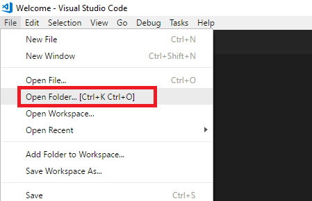

# Azure AD B2C custom policy features

## Policy upload

You can now [upload your policy directly from VS Code](https://github.com/azure-ad-b2c/vscode-extension/blob/master/src/help/policy-upload.md).

## Autocomplete

> [!NOTE]
> Starting August 2021, if the [XML](https://marketplace.visualstudio.com/items?itemName=redhat.vscode-xml), or the [XML Tools
](https://marketplace.visualstudio.com/items?itemName=DotJoshJohnson.xml) XML extensions are installed and activated, the XML extension handles the XML completion. For more information, see [Troubleshoot policy validity](https://docs.microsoft.com/azure/active-directory-b2c/troubleshoot-custom-policies#troubleshoot-policy-validity).

With the autocomplete feature, you can save time when customizing a B2C policy. The B2C extension provides you with a list of the policy settings, claims, technical profiles, and claims transformations aggregated from your policy files. Select one of the following attributes and press `Ctrl+Space` (`Cmd+Space`), or start typing:

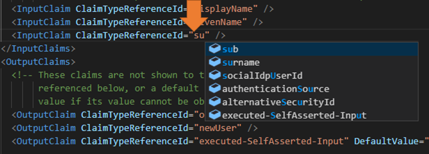

## Custom policy explorer

From the **Custom policy explorer**, click the XML element type and select the element you want to open. The Custom policy explorer shows elements from the selected file only.

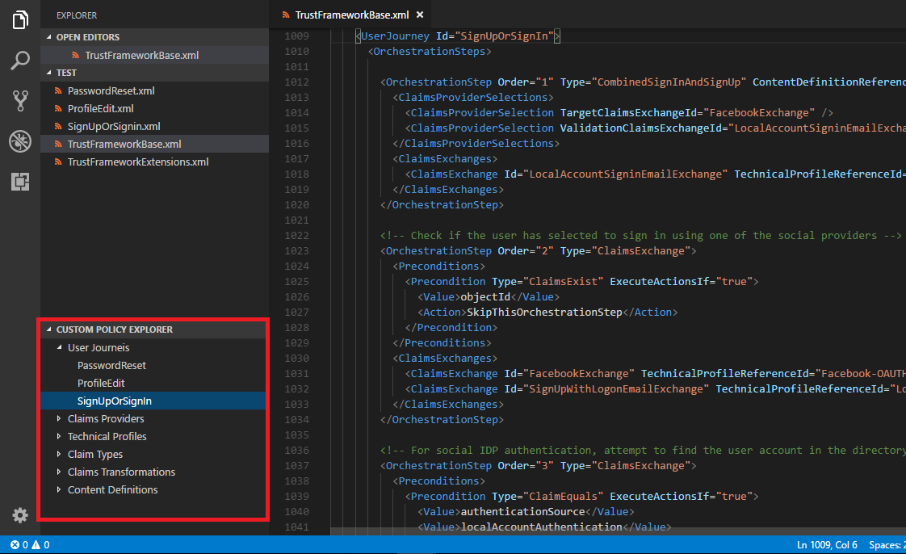

## Go to definition and find all references

To go to any XML element definition. `Ctrl+click`, press `F12`, or right-click and select **Go to Definition** or **Peek Definition**. Go to definition navigates you to the source element in the selected file only.

To search for references in the **opened folder** XML files or any XML file you open with VS Code, select **Find All References**, or press `Shift+F12`.


## Adding XML elements

You can add following elements to your policy. Make sure your cursor is located in the correct location.

* B2C Add Identity provider technical profile (`Shift+Ctrl+1`)
* B2C Add REST API technical profile (`Shift+Ctrl+2`)
* B2C Add Claim Type (`Shift+Ctrl+3`)
* B2C Add Application Insights (debug mode) (`Shift+Ctrl+4`)

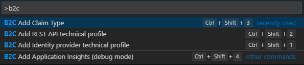

## Orchestration steps renumbering

The **B2C Renumber policy** (`Shift+Ctrl+r`) command renumbers all of the user journeys and sub journeys orchestration steps.

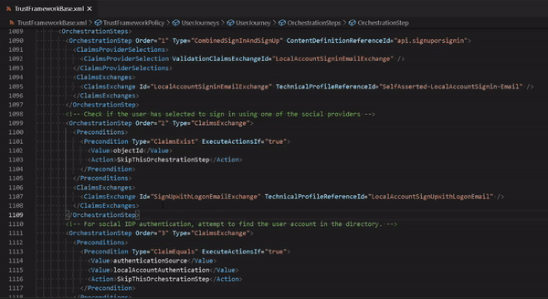

## Smart Copy & Paste

When you customize an XML element in the extension policy, **Smart Copy** allows you to copy the entire element with its parent's elements from the base policy. For example, when you copy the AAD-UserWriteUsingAlternativeSecurityId technical profile, Smart Copy generates an XML snippet containing the following elements so you don't need to search for the parent's element, such as the claim provider.

```XML
<ClaimsProviders>
  <ClaimsProvider>
    <DisplayName>Azure Active Directory</DisplayName>
    <TechnicalProfiles>
      <TechnicalProfile Id="AAD-UserWriteUsingAlternativeSecurityId">
        ...
      </TechnicalProfile>
    </TechnicalProfiles>
  </ClaimsProvider>
<ClaimsProviders>
```

By contrast, the **Smart Paste** feature pastes from the clipboard only the necessary elements. Given the above XML and assuming your extension policy already has a claims provider named `Azure Active Directory`, Smart Paste will paste only the technical profile without the claims provider. However, if there is no such claims provider, Smart Paste will paste the entire XML (including the claims provider and the technical profile).

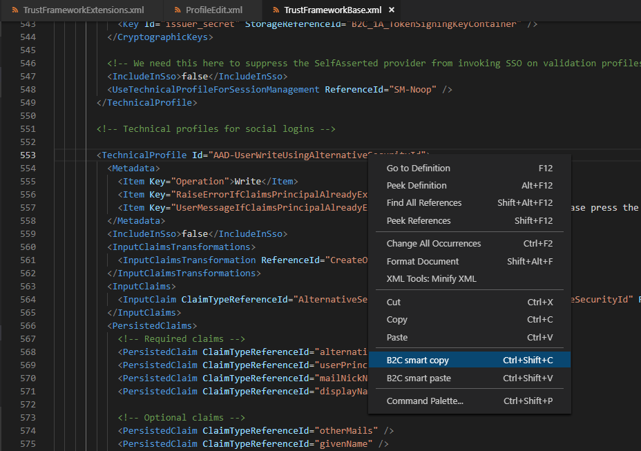

>Note: In this version, Smart Copy and Paste is limited to a single XML node.

## Help and more information

After you run the commands, the B2C extension shows you an informational message with a link to relevant article.

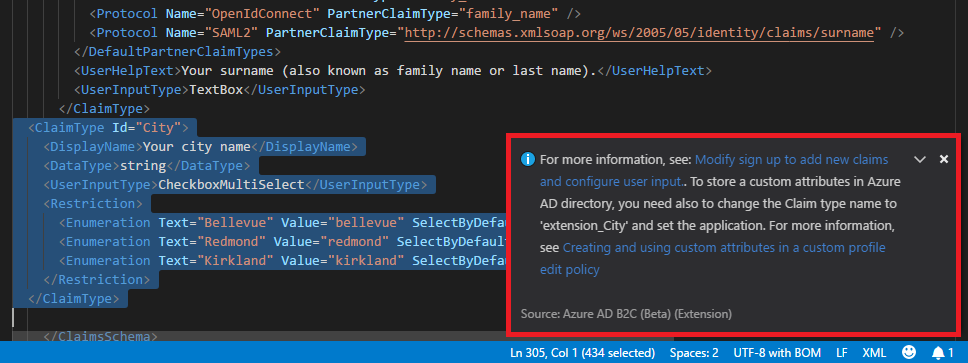

## XML Schema quick help

Hover your mouse cursor over any XML tag name to see its description.

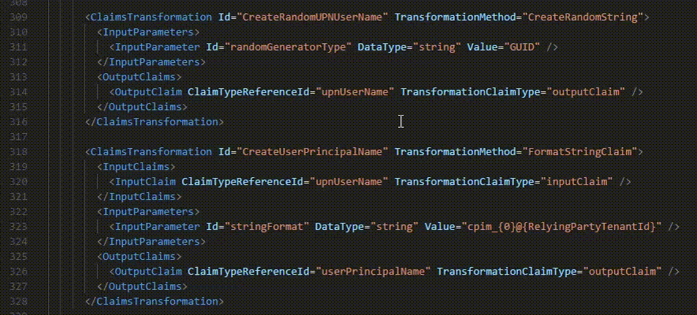

## Application Insights

Collect logs from Azure AD B2C and diagnose problems with the Azure AD B2C VS Code extension. Read more [here](https://github.com/azure-ad-b2c/vscode-extension/blob/master/src/help/app-insights.md). The logs are organized by the **policy name**, **correlation Id** (the application insights presents the first digit of the correlation Id), and the **log timestamp**. This allows you to find the relevant log based on the local timestamp and see the user journey as executed by Azure AD B2C.

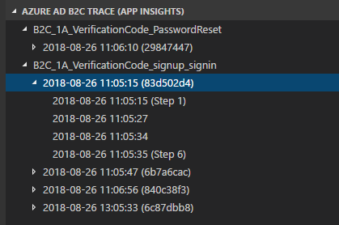

## Policy settings

Allows you to manage the values of your Azure AD B2C environments. When you execute the **B2C Policy build** command, the VS Code extension finds and replaces the values of your settings with the ones configured in the policy file, and creates a directory that contains all of your policy files (after the replacement). In the following example, the extension replaces the keys with the values configured in the `appsettings.json` file:

- `{Settings:Tenant}`
- `{Settings:IdentityExperienceFramework}`
- `{Settings:ProxyIdentityExperienceFrameworkAppId}`
- `{Settings:FacebookAppId}`

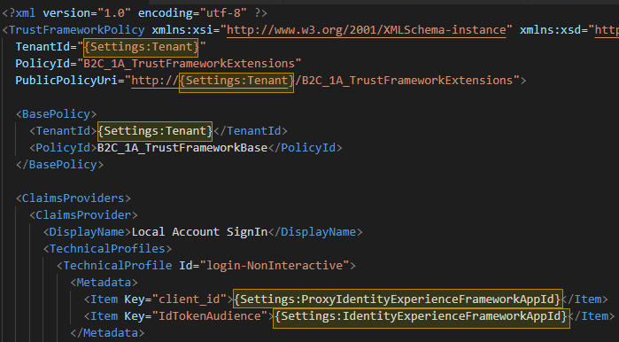

The configuration `appsettings.json` file contains the keys with their values for each environment.

- **Name** contains the environment name that VS Code extension uses to create the environment folder (under the environments parent folder). Use your operating system's legal characters only.
- **Tenant** specifies the tenant name, such as *contoso.onmicrosoft.com*. In the policy file, use the format of **Settings:Tenant**, for example `{Settings:Tenant}`.
- **Production**  (boolean) is preserved for future use, indicating whether the environment is a production one.
- **PolicySettings** contains a collection of key-value pairs with your settings. In the policy file, use the format of **Settings:** and the key name, for example `{Settings:FacebookAppId}`.

To build your policy, type `Ctrl+Shift+P`, which brings up the Command Palette. From here, type `B2C` and select **B2C Policy Build**. You have access to all of the B2C functionality of VS Code, including keyboard shortcuts like `Ctrl+Shift+5`.

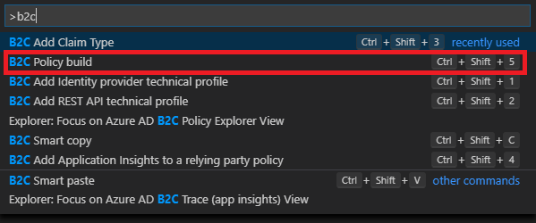

In your policy, you can use one of the following settings:

|Key  |Description  |
|---------|---------|
|`{Settings:Tenant}`| The tenant name|
|`{Settings:Filename}`|The policy file name, without the file extension.|
|`{Settings:PolicyFilename}` | The policy name, without the file extension. Also truncates the B2C_1A_ prefix if included.|
|`{Settings:Environment}`| The name of the environment.|
|`{Settings:<Name>}`| A custom setting name, such as `{Settings:FacebookAppId}`. |

The first time you run the **B2C Policy build** command, the VS code extension lets you create the `appsettings.json` file with a default set of environments, keys, and values:

```JSON
{
  "Environments": [
  {
    "Name": "Development",
    "Production": false,
    "Tenant": "your-tenant.onmicrosoft.com",
    "PolicySettings" : {
      "IdentityExperienceFrameworkAppId": "Your dev environment AD app Id",
      "ProxyIdentityExperienceFrameworkAppId": "Your AD dev environment Proxy app Id",
      "FacebookAppId": "0"
    }
  },
  {
    "Name": "Test",
    "Production": false,
    "Tenant": "your-tenant.onmicrosoft.com",
    "PolicySettings" : {
      "IdentityExperienceFrameworkAppId": "Your test environment AD app Id",
      "ProxyIdentityExperienceFrameworkAppId": "Your test environment AD Proxy app Id",
      "FacebookAppId": "0"
    }
  },
  {
    "Name": "Production",
    "Production": true,
    "Tenant": "your-tenant.onmicrosoft.com",
    "PolicySettings" : {
      "IdentityExperienceFrameworkAppId": "Your production environment AD app Id",
      "ProxyIdentityExperienceFrameworkAppId": "Your production environment AD Proxy app Id",
      "FacebookAppId": "0"
    }
  }]
}
```

You can add or remove environments, keys, and values to accommodate your needs. For example, you can add new settings like the URL of a REST API endpoint, Google+ app Id, or URL of content definitions. You can also add a new environment, such as pre-prod. Make sure you provide the same set of keys (with the relevant values) for each environment. In the following example, we add the **Pre-Production** environment and new set of key-values.

```JSON
{
  "Environments": [
  {
    "Name": "Development",
    ...
  },
  {
    "Name": "Test",
    ...
  },
  {
    "Name": "QA",
    ...
  },
  {
    "Name": "Pre-Production",
  },
  {
    "Name": "Production",
    "Production": true,
    "Tenant": "your-tenant.onmicrosoft.com",
    "PolicySettings" : {
      "IdentityExperienceFrameworkAppId": "Your AD app Id",
      "ProxyIdentityExperienceFrameworkAppId": "Your AD Proxy app Id",
      "FacebookAppId": "0",
      "MicrosoftAppId": "0",
      "GoogleAppId": "0",
      "RESTApiServer": "The location of your REST API",
      "HTMLPagesServer": "The location of your HTML page layout files"
    }
  }]
}
```

## Get B2C application IDs

This command retrieves application ids of applications used in IEF policies and stores them in the appSettings.json file. It retrives application ids for the IEF client and resource apps (used in the login-NonInteractive Technical Profile) and application id and object id of the B2C Extensions app (used in the AAD-Common Technical Profile if needed to to store custom claims as extension attributes in B2C). The command retrieves the values for each B2C tenant identified in the appSettings.json, as per the following example. You can then reference these values using Policy Settings build command described earlier. 

To execute the command press Shift+Ctrl+P and select the 'B2C appSettings: get app ids' option.

Your B2C VSCode Extensions app needs to given Directory.ReadAll delegated permission and consented to in each B2C tenant by its administrator.

```JSON
{
    "Environments": [
        {
            "Name": "Development",
            "Production": false,
            "Tenant": "devtenant.onmicrosoft.com",
            "PolicySettings": {
                "ProxyIdentityExperienceFrameworkAppId": "c805c589-d4e2-43bd-bd75-e1e88df44d2c",
                "FacebookAppId": "0",
                "AADExtensionsAppId": "0428f335-4957-491e-96bb-7ce51b81d46a",
                "AADExtensionsObjectId": "20d75341-a1e5-4ea8-a88f-7e7dfe90b9d8",
                "IdentityExperienceFrameworkAppId": "221dfbdb-064b-4747-a7db-a2b7e9d8865a"
            }
        },
        {
            "Name": "Production",
            "Production": true,
            "Tenant": "prodtenant.onmicrosoft.com",
            "PolicySettings": {
                "ProxyIdentityExperienceFrameworkAppId": "ee90b278-ba82-4dd2-a1b7-ed12aa6f11bf",
                "FacebookAppId": "0",
                "IdentityExperienceFrameworkAppId": "081becc7-eab8-4af1-89c4-eeb8892671a3",
                "AADExtensionsAppId": "bd365420-5f77-4cb6-a224-ef794c2d05e1",
                "AADExtensionsObjectId": "4728bfb6-ff0b-4d84-8402-dc38f2c85da9"
            }
        }
    ]
}
```

After the command is completed, you will find the exported policies under the **Environment** folder. **Important**: Before you upload the policy to your Azure AD B2C tenant, check the values of the exported policy files.


## Disclaimer

This extension is developed and managed by the open-source community on [GitHub](https://github.com/azure-ad-b2c/vscode-extension). The extension is not part of Azure AD B2C product and is not supported under any Microsoft standard support program or service. The extension is provided AS IS without warranty of any kind. For any issues, visit the [GitHub](https://github.com/azure-ad-b2c/vscode-extension) repository.
