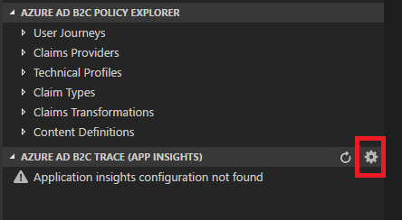

# Set up Azure AD B2C VS Code extension trace log

This article provides steps for collecting logs from Azure AD B2C so that you can diagnose problems with your [Azure AD B2C vscode extension](https://marketplace.visualstudio.com/items?itemName=AzureADB2CTools.aadb2c).

Azure AD B2C supports a feature for sending data to Application Insights.  Application Insights provides a way to diagnose exceptions and visualize application performance issues. For more information, see [Azure Active Directory B2C: Collecting Logs](https://docs.microsoft.com/en-us/azure/active-directory-b2c/active-directory-b2c-troubleshoot-custom)

## 1. Setup Application Insights

1. Go to the [Azure portal](https://portal.azure.com). Ensure you are in the tenant with your Azure subscription (not your Azure AD B2C tenant).
1. Click **+ New** in the left-hand navigation menu.
1. Search for and select **Application Insights**, then click **Create**.
1. Complete the form and click **Create**. Select **General** for the **Application Type**.
1. Once the resource has been created, open the Application Insights resource.
1. Find **Properties** in the left-menu, and click on it.
1. Copy the **Instrumentation Key** and save it for the next section.


For more information, see: [What is Application Insights?](https://docs.microsoft.com/en-us/azure/application-insights/app-insights-overview?toc=/azure/azure-monitor/toc.json) and [Create an Application Insights resource](https://docs.microsoft.com/en-us/azure/application-insights/app-insights-create-new-resource) articles.

## 2. Getting your Application Insights ID and key
This VS Code extension needs your Application Insights ID and an API Key to access Application Insights through the API. To get these two keys:

1. In Azure portal, open the Application Insights resource for your application and open **Settings**, **API Access**.
1. The Application ID is a unique, unchangeable identifier for this application. Copy the Application ID
1. Click on **Create API Key**
1. Check the **Read telemetry** box.
1. Copy the key before closing the Create API key blade and save it somewhere secure. (If you lose the key, you'll need to create another.)
 


## 3. Set up the custom policy

1. Open the RP file (for example, SignUpOrSignin.xml).
1. Add the following attributes to the `<TrustFrameworkPolicy>` element:

  ```XML
  DeploymentMode="Development"
  UserJourneyRecorderEndpoint="urn:journeyrecorder:applicationinsights"
  ```

1. If it doesn't exist already, add a child node `<UserJourneyBehaviors>` to the `<RelyingParty>` node. It must be located immediately after the `<DefaultUserJourney ReferenceId="UserJourney Id from your extensions policy, or equivalent (for example:SignUpOrSigninWithAAD" />`
2. Add the following node as a child of the `<UserJourneyBehaviors>` element. Make sure to replace `{Your Application Insights Key}` with the **Instrumentation Key** that you obtained from Application Insights in the previous section.

  ```XML
  <JourneyInsights TelemetryEngine="ApplicationInsights" InstrumentationKey="{Your Application Insights Key}" DeveloperMode="true" ClientEnabled="false" ServerEnabled="true" TelemetryVersion="1.0.0" />
  ```

  * `DeveloperMode="true"` tells ApplicationInsights to expedite the telemetry through the processing pipeline, good for development, but constrained at high volumes.
  * `ClientEnabled="true"` sends the ApplicationInsights client-side script for tracking page view and client-side errors (not needed).
  * `ServerEnabled="true"` sends the existing UserJourneyRecorder JSON as a custom event to Application Insights.
Sample:

  ```XML
  <TrustFrameworkPolicy
    ...
    TenantId="your-tennat.onmicrosoft.com"
    PolicyId="B2C_1A_signup_signin"
    DeploymentMode="Development"
    UserJourneyRecorderEndpoint="urn:journeyrecorder:applicationinsights"
  >
    ...
    <RelyingParty>
      <DefaultUserJourney ReferenceId="SignUpOrSignIn" />
      <UserJourneyBehaviors>
        <JourneyInsights TelemetryEngine="ApplicationInsights" InstrumentationKey="{Your Application Insights Key}" DeveloperMode="true" ClientEnabled="false" ServerEnabled="true" TelemetryVersion="1.0.0" />
      </UserJourneyBehaviors>
      ...
  </TrustFrameworkPolicy>
  ```

3. Upload the policy.

## 4. Set up Azure AD B2C VS Code extension
Azure AD B2C VS Code extension provides two different scopes for settings:
- **User Global Settings** - Settings that apply globally to any instance of VS Code you open.
- **Workspace Settings** - Settings stored inside your workspace and only apply when the workspace is opened (using VS Code **open folder**).

1. From the **Azure AD B2C Trace** explorer, click on the **Settings** icon.
    
1. Provide the Azure Application Insights **id** and **key** and other settings
1. Click **Save**

### Set up Azure AD B2C VS Code extension manually
The setting page lets you know the location of the settings file. If you open a folder, Azure AD B2C VS Code extension will show you the settings file under current folder. Otherwise, the location of the user global settings file. Follow the [User and Workspace Settings](https://code.visualstudio.com/docs/getstarted/settings) article and learn how to change the settings manually.

Azure AD B2C VS Code extension supports following settings:
- **aadb2c.ai.id** Your Application Insights Id
- **aadb2c.ai.key** Your Application Insights Key
- **aadb2c.ai.maxRows** The number of events to return

For example:

```JSON
    "aadb2c.ai.id": "00000000-0000-0000-0000-000000000000",
    "aadb2c.ai.key": "xxxxxxxxxxxxxxxxxxxxxxxxxxxxxxxxxxxxxxxxx",
    "aadb2c.ai.maxRows": 10
```