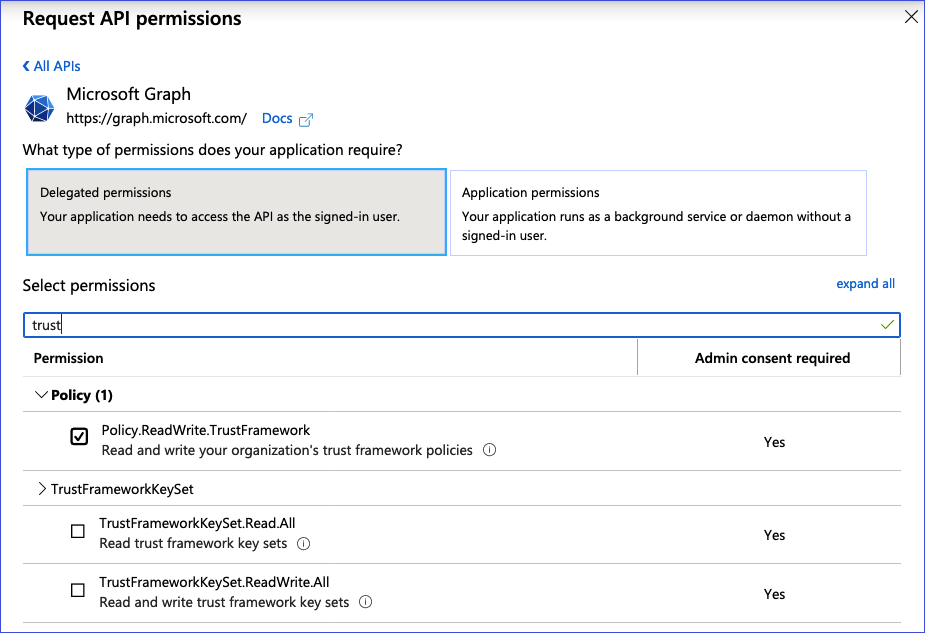
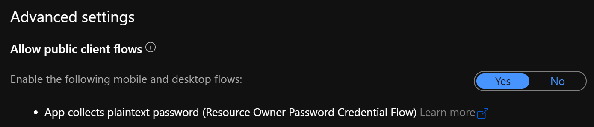

# Upload a custom polices directly from Azure AD B2C vscode extension

## Register MS Graph delegated permissions application

To upload a policy you need to register a delegated permissions application. Learn how to [register a MS Graph application](https://docs.microsoft.com/azure/active-directory-b2c/microsoft-graph-get-started?tabs=applications). In the [Grant API access section](https://docs.microsoft.com/azure/active-directory-b2c/microsoft-graph-get-started?tabs=applications#grant-api-access) select the **Delegate permissions**, and then select **Read and write your organization's trust framework policies** and select **Save**. Select **Grant permissions**, and then select **Yes**. It might take a few minutes to for the permissions to fully propagate. 

Change the application authentication setting **Allow public client flows** to **Yes**. You can find this under "Authentication" -> "Advanced settings" in the menu.

After it's created, copy the Application ID: 

## Configure your VS code extension

Within VSCode, click on the **Settings** icon.

Choose **Extensions** and then “**Azure AD B2C**” 
In the **Graph: ClientId**, set the value of the application ID you created earlier.
**IMPORTANT**: you can change this setting at the *User* or *Workspace* level. Changing it at *Workspace* lavel is highly recommended since you will be able to use different application IDs for different projects/folders.

## Upload a policy

To upload a policy

- `CTRL` + `SHIFT + P`
- Type **B2C Upload Policy**
- You will then see the following. Click Login to launch the browser for Device code login

    

- Enter the code or paste from clipboard (the code should have already been added to the clipboard)

    

- Sign-in with your Azure AD B2C tenant admin account

## Upload all policies for an environment

The default environment name in the extension's settings needs to be configured before using 'Upload all policies' command. if this is not set then the extension will upload policies from the root working folder. Before uploading a specific environment run **B2C Policy Build** command.

The same process for logging in to Azure should be followed (refer to the "Upload a policy" section above).

To initiate the upload press `ALT`+`SHIFT`+`U` or launch the **B2C Upload all policies** command in the commands list (`CTRL`+`SHIFT`+`P`).

Once all policies are successfully uploaded a popup will display a success message stating the number of policies uploaded. An error message will be displayed for all failed uploads. If any of the policies have failed to upload the whole job will terminate immediately and an error message will be displayed.
