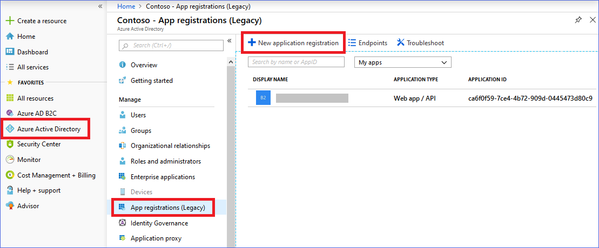
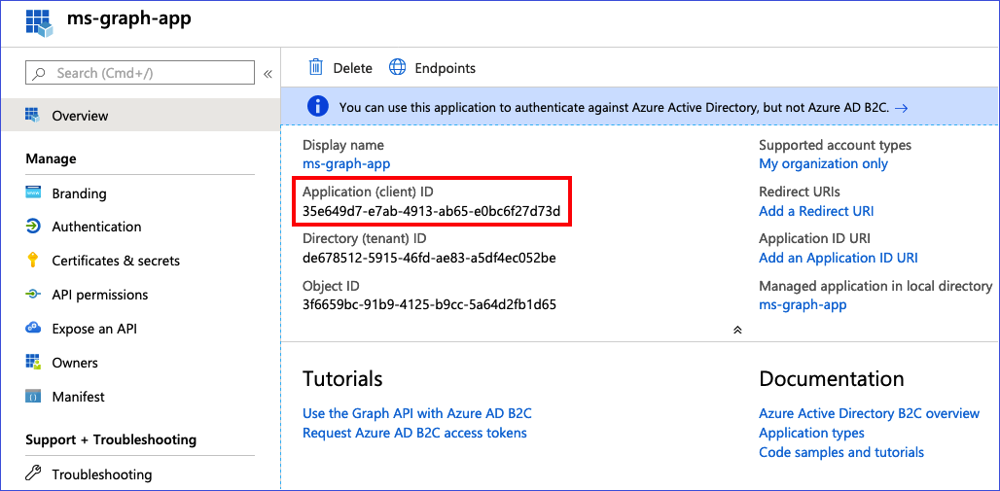
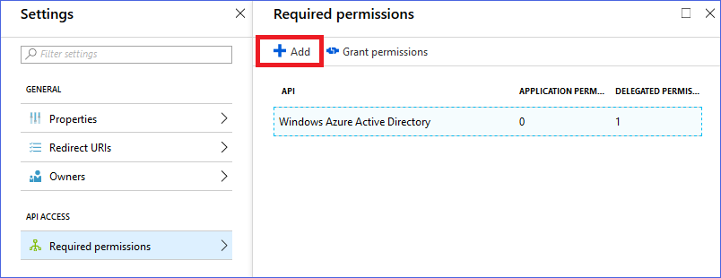
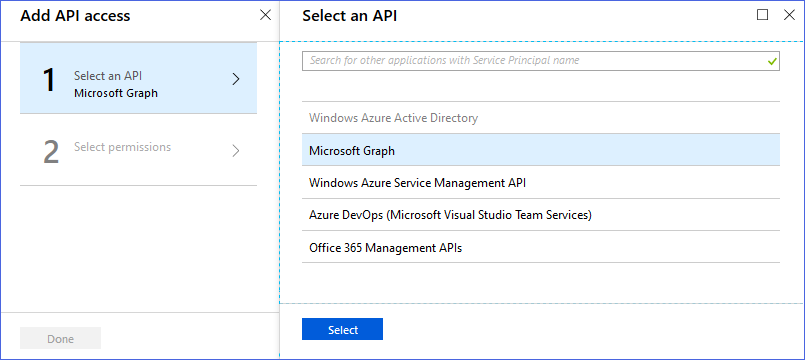
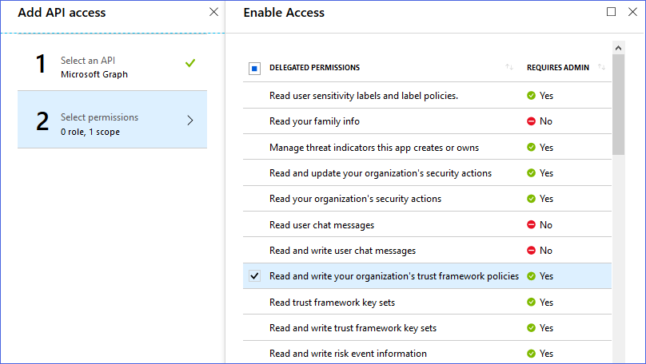
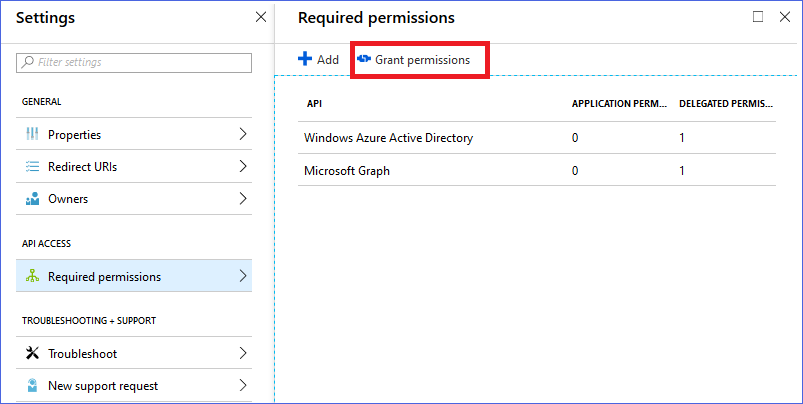

# Upload a custom polices directly from Azure AD B2C vscode extension

## Register MS Graph delegated permissions application
To upload a policy you need to register a delegated permissions application.

1. Navigate to the Azure portal.
1. Select **Azure Active Directory** > **App Registrations (Legacy)**. Note: this version supports only Azure AD App v1
    
1. For **Name**, enter `MsGraphApp`.
1. For **Application type**, select `Native`
1. For the **Redirect URI**, type the URL to `https://localhost`
1. Click **Create**. 
1. After it's created, copy the **Application ID** and save it to use later.
    

Now you need to configure your application to get all the required permissions as specified in the next section
1. After you create an Azure AD application, continuing in the Azure portal's App Registrations menu, select your application.
1. Click on **Settings**
1. In the **API Access** menu, click on **Required permissions**. 
1. Click on **Add**.
    
1. In the **Select API**, choose  **Microsoft Graph**, and click **Select**.
    
1. In the **Delegate permissions** menu, select **Read and write your organization's trust framework policies**.
    
1. Finally, back in the **Required permissions** menu, click on the **Grant permissions** button.
    

## Configure your VS code extension 
Within VSCode, click on the **Settings** icon.

Choose **Extensions** and then “**Azure AD B2C**” 
In the **Graph: ClientId**, set the value of the application ID you created earlier.

## Upload a policy
To upload a policy
- `CTRL` + `SHIFT + P`
- Type **B2C Upload Policy**
- You will then see the following. Click Login to launch the browser for Device code login
    
- Enter the code or paste from clipboard (the code should have already been added to the clipboard)
    
- Sign-in with your Azure AD B2C tenant admin account

## Upload all policies for an environment
The default environment name in the extension's settings needs to be configured before using 'Upload all policies' command. if this is not set then the extension will upload policies from the root working folder. Before uploading a specific environment run **B2C Policy Build** command.

The same process for logging in to Azure should be followed (refer to the "Upload a policy" section above).

To initiate the upload press `ALT`+`SHIFT`+`U` or launch the **B2C Upload all policies** command in the commands list (`CTRL`+`SHIFT`+`P`).

Once all policies are successfully uploaded a popup will display a success message stating the number of policies uploaded. An error message will be displayed for all failed uploads. If any of the policies have failed to upload the whole job will terminate immediately and an error message will be displayed.
