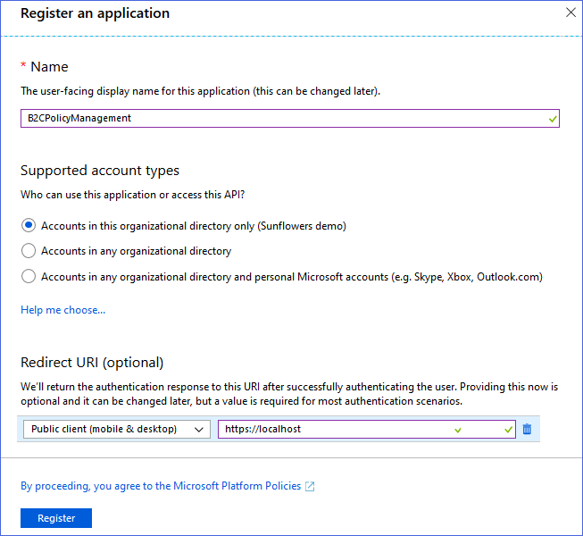
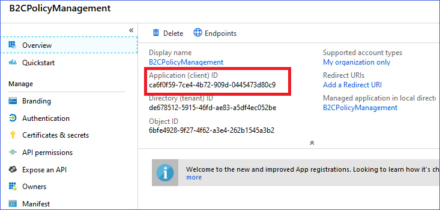
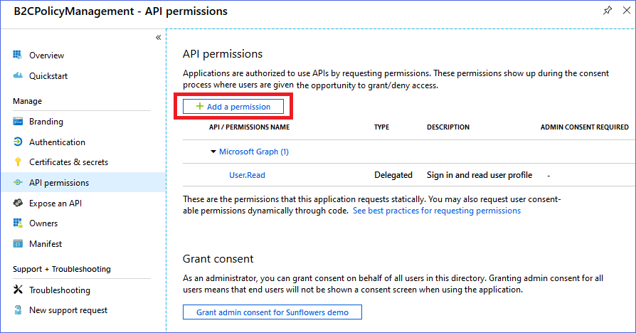
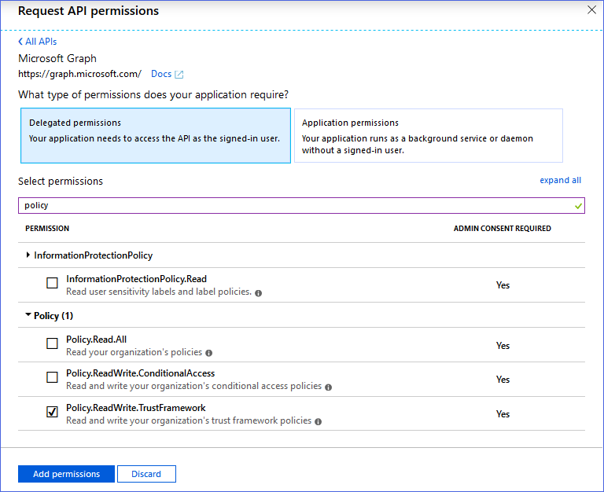
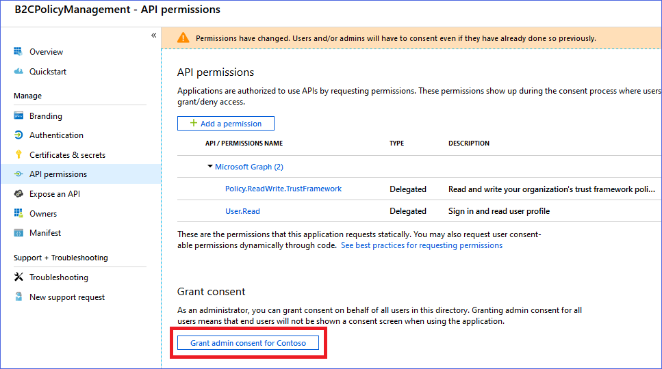
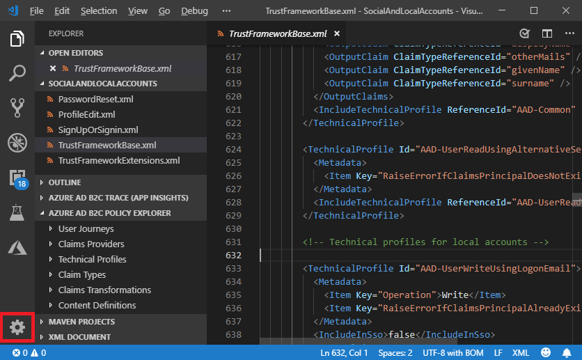
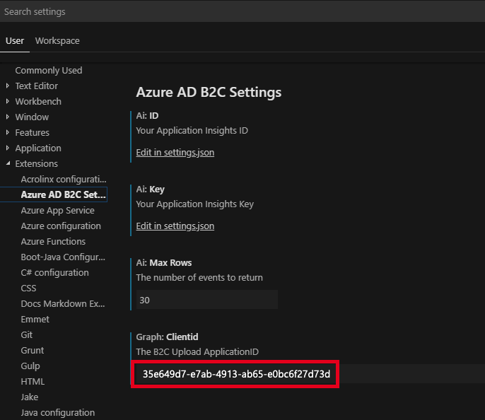
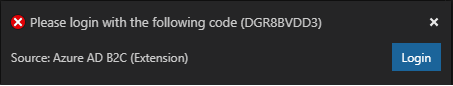
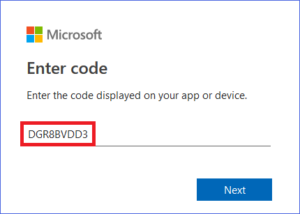

# Upload a custom polices directly from Azure AD B2C vscode extension

## Register MS Graph delegated permissions application
To upload a policy you need to register the delegated permissions application.

1. Choose **All services** in the top-left corner of the Azure portal, search for and select **App registrations**.
1. Select **New registration**.
1. For **Name**, enter `B2CPolicyManagement`.
1. For **Supported account types**, select `Accounts in this organizational directory only`
1. For the **Redirect URI**, select **Public client**, and set the URL to `https://localhost`
1. Click **Register**. 
    
1. After it's created, copy the **Application ID** and save it to use later.
    

Now you need to configure your application to get all the required permissions as specified in the next section
1. After you create an Azure AD application, continuing in the Azure portal's App Registrations menu, select your application.
1. In the **Manage** menu, click on **API permissions**. 
1. Click on **Add a permission**.
    
1. In the **Select API**, choose  **Microsoft Graph**, and click **Select**.
1. In the **Delegate permissions** menu, search for **policy** and select **Read and write your organization's trust framework policies**.
    
1. Finally, back in the Required permissions menu, click on the **Grant admin consent** button.
    

## Configure your VS code extension 
Within VSCode, click on the **Settings** icon.

Choose **Extensions** and then “**Azure AD B2C**” 
In the **Grpah: ClientId**, set the value of the application ID you created earlier.

## Upload a policy
To upload a policy
- `CTRL` + `SHIFT + P`
- Type **B2C Upload Policy**
- You will then see the following. Click Login to launch the browser for Device code login
    
- Enter the code or paste from clipboard (the code should have already been added to the clipboard)
    